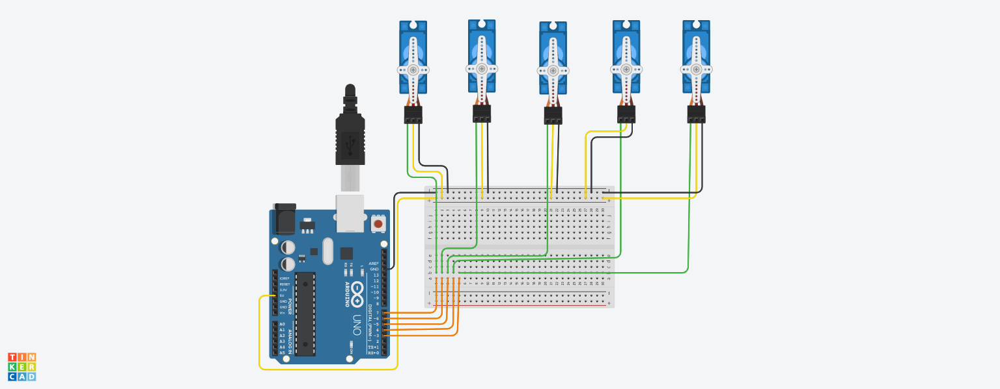

# arduino_robot_arm
This circuit simulation is done using Tinckercad, the circuit consists of one Arduino and 5 Servos moving simultaneously from 0 to 90 degrees *refer to the code and circuit image below*

The servo require 3 connections (power, ground, plus) which are provided by the arduino, however, having multiple servos requires the use of a breadboard to expand the arduino connections to all the exsisiting servos.

After completeing the circuit connections, start to code by initializing the servos (code: line 2-6) and assigning each servo to a pin, then attach each one to the desired servo object (code: line 11-15).

Then simultaneously move the servos from the initial position using an increasing loop(code: line 21-29) until it reaches 90 degrees, then it will descend to reach the initial position using the descending loop(code: line 31-39).

### Code 

### Circuit video 

### Circuit diagram 

